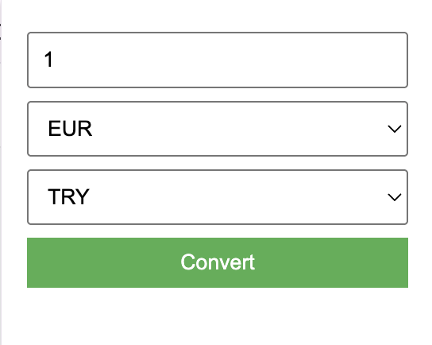

# 💱 Currency Converter Chrome Extension

A simple and efficient Chrome Extension to convert currencies (EUR, USD, TRY) using real-time exchange rates. Built
using **Manifest V3** and a lightweight API for fast, no-key conversion.

## 🚀 Features

- Convert between **EUR**, **USD**, and **TRY**
- Clean and compact popup interface
- Uses **open.er-api.com** (no API key required)
- Caches rates locally for 24 hours to minimize API calls
- Built with **Chrome Manifest V3**

## 🖼️ UI Preview

 <!-- Optional: Add a screenshot file -->

## 📦 Installation

1. **Clone or download** this repository.
2. Go to `chrome://extensions/` in your browser.
3. Enable **Developer Mode** (top right).
4. Click **Load unpacked** and select the project folder.
5. Click the extension icon to start converting!

## 🔧 How It Works

- On clicking the extension icon, a popup appears with:
    - Amount input
    - Dropdowns for "From" and "To" currencies (default: EUR → TRY)
    - Convert button and result display
- Rates are fetched from `https://open.er-api.com/v6/latest/{base}`
- Cached results are stored in `chrome.storage.local` for 24 hours

## 📡 API Used

- **Open Exchange Rates API**
    - Endpoint: `https://open.er-api.com/v6/latest/{base}`
    - Free, reliable, no API key required
    - Updated daily

## 🛡 Permissions

Only uses:

- `storage` — to cache exchange rate data

No tracking, no analytics.

## 📥 Future Improvements

- Support more currencies
- Offline conversion using stored rates
- Rate chart or historical data

## 📝 License

MIT License

---

## ⚠️ Legal Note and Disclaimer

This extension is provided **for informational purposes only** and is **not intended for financial or investment advice
**.

Exchange rates are sourced from a third-party API (https://open.er-api.com). While we aim to provide accurate and
up-to-date information, **we do not guarantee the correctness, completeness, or timeliness** of the data.

**Use at your own risk.** We are not responsible for any financial decisions made based on the output of this tool.
Always consult an official or financial source before making currency conversions for business or legal purposes.
